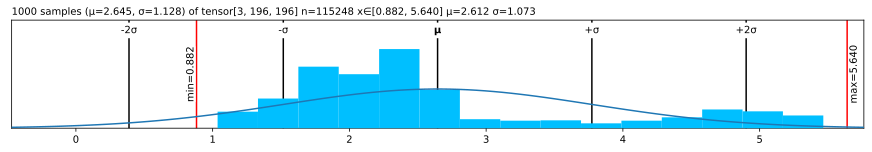
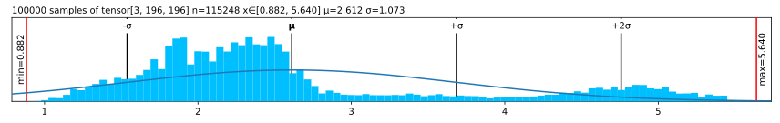
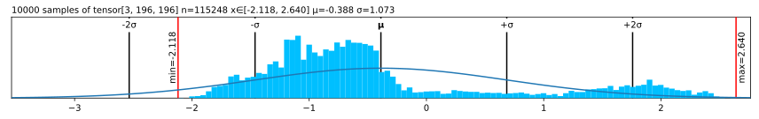

Lovely Tensors
================

<!-- WARNING: THIS FILE WAS AUTOGENERATED! DO NOT EDIT! -->

## Install

``` sh
pip install lovely-tensors
```

## How to use

How often do you find yourself debuggin PyTorch code? You dump a tensor
to the cell output, and see this:

``` python
numbers
```

    tensor([[[-0.3541, -0.3369, -0.4054,  ..., -0.5596, -0.4739,  2.2489],
             [-0.4054, -0.4226, -0.4911,  ..., -0.9192, -0.8507,  2.1633],
             [-0.4739, -0.4739, -0.5424,  ..., -1.0390, -1.0390,  2.1975],
             ...,
             [-0.9020, -0.8335, -0.9363,  ..., -1.4672, -1.2959,  2.2318],
             [-0.8507, -0.7822, -0.9363,  ..., -1.6042, -1.5014,  2.1804],
             [-0.8335, -0.8164, -0.9705,  ..., -1.6555, -1.5528,  2.1119]],

            [[-0.1975, -0.1975, -0.3025,  ..., -0.4776, -0.3725,  2.4111],
             [-0.2500, -0.2325, -0.3375,  ..., -0.7052, -0.6702,  2.3585],
             [-0.3025, -0.2850, -0.3901,  ..., -0.7402, -0.8102,  2.3761],
             ...,
             [-0.4251, -0.2325, -0.3725,  ..., -1.0903, -1.0203,  2.4286],
             [-0.3901, -0.2325, -0.4251,  ..., -1.2304, -1.2304,  2.4111],
             [-0.4076, -0.2850, -0.4776,  ..., -1.2829, -1.2829,  2.3410]],

            [[-0.6715, -0.9853, -0.8807,  ..., -0.9678, -0.6890,  2.3960],
             [-0.7238, -1.0724, -0.9678,  ..., -1.2467, -1.0201,  2.3263],
             [-0.8284, -1.1247, -1.0201,  ..., -1.2641, -1.1596,  2.3786],
             ...,
             [-1.2293, -1.4733, -1.3861,  ..., -1.5081, -1.2641,  2.5180],
             [-1.1944, -1.4559, -1.4210,  ..., -1.6476, -1.4733,  2.4308],
             [-1.2293, -1.5256, -1.5081,  ..., -1.6824, -1.5256,  2.3611]]])

Was it really useful?

What is the shape?  
What are the statistics?  
Are any of the values `nan` or `inf`?  
Is it an image of a man holding a tench?

``` python
import lovely_tensors as lt
```

``` python
lt.monkey_patch()
```

## `__repr__()`

``` python
# A very short tensor - no min/max
numbers.flatten()[:2]
```

    tensor[2] μ=-0.345 σ=0.012 [-0.354, -0.337]

``` python
# A slightly longer one
numbers.flatten()[:6].view(2,3)
```

    tensor[2, 3] n=6 x∈[-0.440, -0.337] μ=-0.388 σ=0.038 [[-0.354, -0.337, -0.405], [-0.440, -0.388, -0.405]]

``` python
# Too long to show the values
numbers
```

    tensor[3, 196, 196] n=115248 x∈[-2.118, 2.640] μ=-0.388 σ=1.073

``` python
spicy = numbers.flatten()[:12].clone()

spicy[0] *= 10000
spicy[1] /= 10000
spicy[2] = float('inf')
spicy[3] = float('-inf')
spicy[4] = float('nan')

spicy = spicy.reshape((2,6))
spicy
```

    tensor[2, 6] n=12 x∈[-3.541e+03, -3.369e-05] μ=-393.776 σ=1.180e+03 +inf! -inf! nan!

``` python
# A zero tensor
torch.zeros(10, 10)
```

    tensor[10, 10] n=100 all_zeros

``` python
spicy.verbose
```

    tensor[2, 6] n=12 x∈[-3.541e+03, -3.369e-05] μ=-393.776 σ=1.180e+03 +inf! -inf! nan!
    [[-3.5405e+03, -3.3693e-05,         inf,        -inf,         nan, -4.0543e-01],
     [-4.2255e-01, -4.9105e-01, -5.0818e-01, -5.5955e-01, -5.4243e-01, -5.0818e-01]]

``` python
spicy.plain
```

    [[-3.5405e+03, -3.3693e-05,         inf,        -inf,         nan, -4.0543e-01],
     [-4.2255e-01, -4.9105e-01, -5.0818e-01, -5.5955e-01, -5.4243e-01, -5.0818e-01]]

## Going `.deeper`

``` python
numbers.deeper
```

    tensor[3, 196, 196] n=115248 x∈[-2.118, 2.640] μ=-0.388 σ=1.073
      tensor[196, 196] n=38416 x∈[-2.118, 2.249] μ=-0.324 σ=1.036
      tensor[196, 196] n=38416 x∈[-1.966, 2.429] μ=-0.274 σ=0.973
      tensor[196, 196] n=38416 x∈[-1.804, 2.640] μ=-0.567 σ=1.178

``` python
# You can go deeper if you need to
dt = torch.randn(3, 3, 5)
dt.deeper(2)
```

    tensor[3, 3, 5] n=45 x∈[-2.135, 2.114] μ=0.021 σ=0.897
      tensor[3, 5] n=15 x∈[-1.250, 2.114] μ=0.026 σ=0.880
        tensor[5] x∈[-0.359, 1.194] μ=0.216 σ=0.669 [-0.355, 1.194, 0.015, 0.585, -0.359]
        tensor[5] x∈[-1.250, 2.114] μ=0.097 σ=1.245 [0.173, 2.114, -1.250, -0.145, -0.409]
        tensor[5] x∈[-1.117, 0.793] μ=-0.235 σ=0.759 [-0.097, -0.830, 0.075, -1.117, 0.793]
      tensor[3, 5] n=15 x∈[-1.170, 1.746] μ=-0.018 σ=0.805
        tensor[5] x∈[-1.170, 0.432] μ=-0.019 σ=0.655 [0.338, 0.432, 0.137, -1.170, 0.170]
        tensor[5] x∈[-0.941, 0.543] μ=-0.426 σ=0.565 [-0.558, -0.620, -0.941, 0.543, -0.553]
        tensor[5] x∈[-0.984, 1.746] μ=0.392 σ=1.050 [0.685, -0.275, 0.788, 1.746, -0.984]
      tensor[3, 5] n=15 x∈[-2.135, 1.834] μ=0.055 σ=1.049
        tensor[5] x∈[-0.639, 1.282] μ=0.505 σ=0.796 [1.282, 0.074, -0.639, 0.662, 1.144]
        tensor[5] x∈[-2.135, 1.834] μ=-0.360 σ=1.462 [1.834, -0.218, -0.187, -1.095, -2.135]
        tensor[5] x∈[-0.944, 0.971] μ=0.021 σ=0.781 [-0.944, 0.658, -0.352, 0.971, -0.230]

## Now in `.rgb` colour

The important queston - is it our man?

``` python
numbers.rgb
```


*Maaaaybe?* Looks like someone normalized him.

``` python
in_stats = { "mean": (0.485, 0.456, 0.406),
             "std": (0.229, 0.224, 0.225) }
numbers.rgb(in_stats)
```


It’s indeed our hero, the Tenchman!

## `.plt` the statistics

``` python
(numbers+3).plt
```



``` python
(numbers+3).plt(center="mean")
```


``` python
(numbers+3).plt(center="range")
```



## Without `.monkey_patch`

``` python
lt.lovely(spicy)
```

    tensor[2, 6] n=12 x∈[-3.541e+03, -3.369e-05] μ=-393.776 σ=1.180e+03 +inf! -inf! nan!

``` python
lt.lovely(spicy, verbose=True)
```

    tensor[2, 6] n=12 x∈[-3.541e+03, -3.369e-05] μ=-393.776 σ=1.180e+03 +inf! -inf! nan!
    [[-3.5405e+03, -3.3693e-05,         inf,        -inf,         nan, -4.0543e-01],
     [-4.2255e-01, -4.9105e-01, -5.0818e-01, -5.5955e-01, -5.4243e-01, -5.0818e-01]]

``` python
lt.lovely(numbers, depth=1)
```

    tensor[3, 196, 196] n=115248 x∈[-2.118, 2.640] μ=-0.388 σ=1.073
      tensor[196, 196] n=38416 x∈[-2.118, 2.249] μ=-0.324 σ=1.036
      tensor[196, 196] n=38416 x∈[-1.966, 2.429] μ=-0.274 σ=0.973
      tensor[196, 196] n=38416 x∈[-1.804, 2.640] μ=-0.567 σ=1.178

``` python
lt.rgb(numbers, in_stats)
```


``` python
lt.plot(numbers, center="mean")
```


