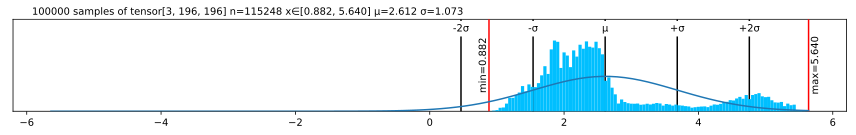
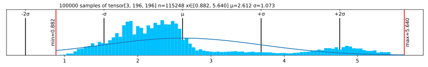

Lovely Tensors
================

<!-- WARNING: THIS FILE WAS AUTOGENERATED! DO NOT EDIT! -->

## Install

``` sh
pip install lovely-tensors
```

## How to use


How often do you find yourself debuggin a neural network? You dump a
tensor to the cell output, and see this:

``` python
numbers
```

    tensor([[[-0.3541, -0.3369, -0.4054,  ..., -0.5596, -0.4739,  2.2489],
             [-0.4054, -0.4226, -0.4911,  ..., -0.9192, -0.8507,  2.1633],
             [-0.4739, -0.4739, -0.5424,  ..., -1.0390, -1.0390,  2.1975],
             ...,
             [-0.9020, -0.8335, -0.9363,  ..., -1.4672, -1.2959,  2.2318],
             [-0.8507, -0.7822, -0.9363,  ..., -1.6042, -1.5014,  2.1804],
             [-0.8335, -0.8164, -0.9705,  ..., -1.6555, -1.5528,  2.1119]],

            [[-0.1975, -0.1975, -0.3025,  ..., -0.4776, -0.3725,  2.4111],
             [-0.2500, -0.2325, -0.3375,  ..., -0.7052, -0.6702,  2.3585],
             [-0.3025, -0.2850, -0.3901,  ..., -0.7402, -0.8102,  2.3761],
             ...,
             [-0.4251, -0.2325, -0.3725,  ..., -1.0903, -1.0203,  2.4286],
             [-0.3901, -0.2325, -0.4251,  ..., -1.2304, -1.2304,  2.4111],
             [-0.4076, -0.2850, -0.4776,  ..., -1.2829, -1.2829,  2.3410]],

            [[-0.6715, -0.9853, -0.8807,  ..., -0.9678, -0.6890,  2.3960],
             [-0.7238, -1.0724, -0.9678,  ..., -1.2467, -1.0201,  2.3263],
             [-0.8284, -1.1247, -1.0201,  ..., -1.2641, -1.1596,  2.3786],
             ...,
             [-1.2293, -1.4733, -1.3861,  ..., -1.5081, -1.2641,  2.5180],
             [-1.1944, -1.4559, -1.4210,  ..., -1.6476, -1.4733,  2.4308],
             [-1.2293, -1.5256, -1.5081,  ..., -1.6824, -1.5256,  2.3611]]])

Was it really useful?

What is the shape?  
What are the statistics?  
Are any of the values `nan` or `inf`?  
Is it an image of a man holding a tench?

``` python
import lovely_tensors.tensors as lt
```

``` python
lt.PRINT_OPTS.color=True
```

``` python
# A very short tensor - no min/max
print(lt.lovely(numbers.view(-1)[:2]))
# A slightly longer tensor
print(lt.lovely(numbers.view(-1)[:6].view(2,3)))
```

    tensor[2] μ=-0.345 σ=0.012 [-0.354, -0.337]
    tensor[2, 3] n=6 x∈[-0.440, -0.337] μ=-0.388 σ=0.038 [[-0.354, -0.337, -0.405], [-0.440, -0.388, -0.405]]

``` python
lt.lovely(numbers)
```

    tensor[3, 196, 196] n=115248 x∈[-2.118, 2.640] μ=-0.388 σ=1.073

``` python
lt.lovely(numbers, depth=1)
```

    tensor[3, 196, 196] n=115248 x∈[-2.118, 2.640] μ=-0.388 σ=1.073
      tensor[196, 196] n=38416 x∈[-2.118, 2.249] μ=-0.324 σ=1.036
      tensor[196, 196] n=38416 x∈[-1.966, 2.429] μ=-0.274 σ=0.973
      tensor[196, 196] n=38416 x∈[-1.804, 2.640] μ=-0.567 σ=1.178

``` python
t = numbers.view(-1)[:12].clone()

t[0] *= 10000
t[1] /= 10000
t[2] = float('inf')
t[3] = float('-inf')
t[4] = float('nan')
t = t.reshape((2,6))
```

``` python
# A spicy tensor
lt.lovely(t)
```

    tensor[2, 6] n=12 x∈[-3.541e+03, -3.369e-05] μ=-393.776 σ=1.180e+03 +inf! -inf! nan!

``` python
# A zero tensor
lt.lovely(torch.zeros(10, 10))
```

    tensor[10, 10] n=100 all_zeros

Now the important queston - is it our man?

``` python
lt.rgb(numbers)
```


*Maaaaybe?* Looks like someone normalized him.

``` python
in_stats = { "mean": (0.485, 0.456, 0.406),
             "std": (0.229, 0.224, 0.225) }
lt.rgb(numbers, in_stats)
```


There can be no doubt, it’s out hero the Tenchman!

One last thing - let’s monkey-patch `torch.Tensor` for convenience.

``` python
lt.monkey_patch()
t
```

    tensor[2, 6] n=12 x∈[-3.541e+03, -3.369e-05] μ=-393.776 σ=1.180e+03 +inf! -inf! nan!

``` python
t.verbose
```

    tensor[2, 6] n=12 x∈[-3.541e+03, -3.369e-05] μ=-393.776 σ=1.180e+03 +inf! -inf! nan!
    [[-3.5405e+03, -3.3693e-05,         inf,        -inf,         nan, -4.0543e-01],
       [-4.2255e-01, -4.9105e-01, -5.0818e-01, -5.5955e-01, -5.4243e-01, -5.0818e-01]]

``` python
t.plain
```

    [[-3.5405e+03, -3.3693e-05,         inf,        -inf,         nan, -4.0543e-01],
     [-4.2255e-01, -4.9105e-01, -5.0818e-01, -5.5955e-01, -5.4243e-01, -5.0818e-01]]

``` python
numbers.rgb
# you can also do numbers.rgb()
```


``` python
#per-channel stats
numbers.deeper
```

    tensor[3, 196, 196] n=115248 x∈[-2.118, 2.640] μ=-0.388 σ=1.073
      tensor[196, 196] n=38416 x∈[-2.118, 2.249] μ=-0.324 σ=1.036
      tensor[196, 196] n=38416 x∈[-1.966, 2.429] μ=-0.274 σ=0.973
      tensor[196, 196] n=38416 x∈[-1.804, 2.640] μ=-0.567 σ=1.178

``` python
# You can go even deeper if you want to
dt = torch.randn(3, 3, 5)
dt.deeper(2)
```

    tensor[3, 3, 5] n=45 x∈[-1.606, 3.044] μ=0.032 σ=0.992
      tensor[3, 5] n=15 x∈[-1.399, 0.825] μ=-0.208 σ=0.645
        tensor[5] x∈[-0.902, 0.627] μ=-0.039 σ=0.560 [0.186, -0.136, 0.627, 0.031, -0.902]
        tensor[5] x∈[-1.399, 0.762] μ=-0.313 σ=0.797 [0.762, -0.371, 0.036, -0.592, -1.399]
        tensor[5] x∈[-0.838, 0.825] μ=-0.271 σ=0.674 [-0.809, -0.304, 0.825, -0.838, -0.231]
      tensor[3, 5] n=15 x∈[-1.606, 2.107] μ=0.108 σ=1.148
        tensor[5] x∈[-1.294, 1.127] μ=0.031 σ=0.981 [0.801, 0.034, -1.294, 1.127, -0.515]
        tensor[5] x∈[-1.606, 2.107] μ=0.283 σ=1.613 [2.107, 1.197, 0.935, -1.218, -1.606]
        tensor[5] x∈[-0.925, 1.488] μ=0.012 σ=0.995 [1.488, -0.538, -0.531, 0.565, -0.925]
      tensor[3, 5] n=15 x∈[-1.598, 3.044] μ=0.196 σ=1.125
        tensor[5] x∈[-0.198, 0.845] μ=0.483 σ=0.459 [0.845, 0.213, 0.797, 0.759, -0.198]
        tensor[5] x∈[-0.407, 3.044] μ=0.604 σ=1.470 [-0.407, -0.241, 0.937, -0.314, 3.044]
        tensor[5] x∈[-1.598, 0.684] μ=-0.498 σ=1.069 [0.614, -1.011, -1.178, 0.684, -1.598]

``` python
# A quick de-norm. Don't worry, the data stays the same.
numbers.rgb(in_stats)
```


``` python
(numbers+3).plt
```



``` python
(numbers+3).plt(center="mean")
```


``` python
(numbers+3).plt(center="range")
```


