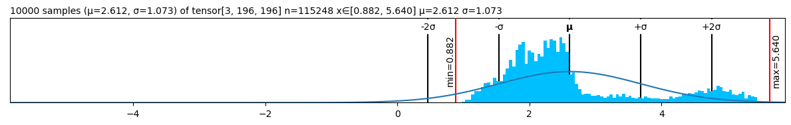
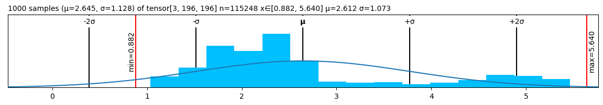
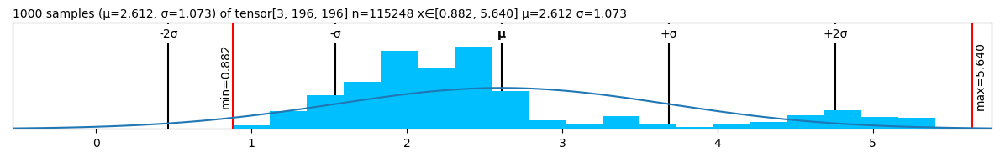
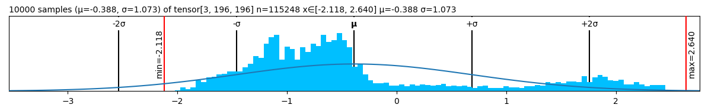
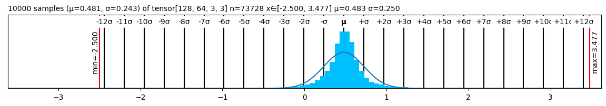
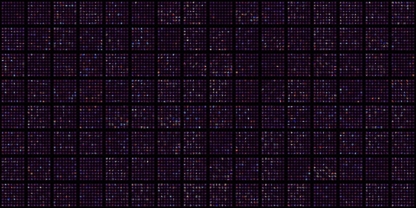
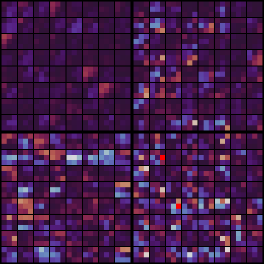
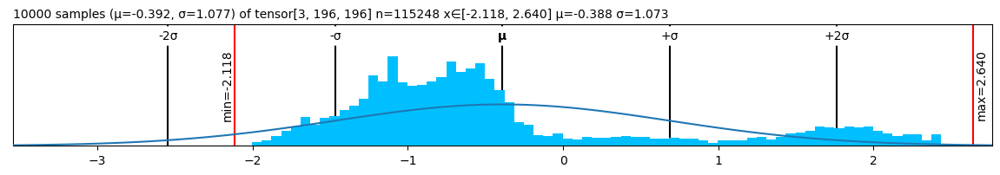

❤️ Lovely Tensors
================

<!-- WARNING: THIS FILE WAS AUTOGENERATED! DO NOT EDIT! -->

<div>

## [Read full docs](https://xl0.github.io/lovely-tensors) \| 💘 [Lovely `JAX`](https://github.com/xl0/lovely-jax) \| 💟 [Lovely `NumPy`](https://github.com/xl0/lovely-numpy) \| [Discord](https://discord.gg/4NxRV7NH)

</div>

## Install

``` sh
pip install lovely-tensors
```

## How to use

How often do you find yourself debugging PyTorch code? You dump a tensor
to the cell output, and see this:

``` python
numbers
```

    tensor([[[-0.3541, -0.3369, -0.4054,  ..., -0.5596, -0.4739,  2.2489],
             [-0.4054, -0.4226, -0.4911,  ..., -0.9192, -0.8507,  2.1633],
             [-0.4739, -0.4739, -0.5424,  ..., -1.0390, -1.0390,  2.1975],
             ...,
             [-0.9020, -0.8335, -0.9363,  ..., -1.4672, -1.2959,  2.2318],
             [-0.8507, -0.7822, -0.9363,  ..., -1.6042, -1.5014,  2.1804],
             [-0.8335, -0.8164, -0.9705,  ..., -1.6555, -1.5528,  2.1119]],

            [[-0.1975, -0.1975, -0.3025,  ..., -0.4776, -0.3725,  2.4111],
             [-0.2500, -0.2325, -0.3375,  ..., -0.7052, -0.6702,  2.3585],
             [-0.3025, -0.2850, -0.3901,  ..., -0.7402, -0.8102,  2.3761],
             ...,
             [-0.4251, -0.2325, -0.3725,  ..., -1.0903, -1.0203,  2.4286],
             [-0.3901, -0.2325, -0.4251,  ..., -1.2304, -1.2304,  2.4111],
             [-0.4076, -0.2850, -0.4776,  ..., -1.2829, -1.2829,  2.3410]],

            [[-0.6715, -0.9853, -0.8807,  ..., -0.9678, -0.6890,  2.3960],
             [-0.7238, -1.0724, -0.9678,  ..., -1.2467, -1.0201,  2.3263],
             [-0.8284, -1.1247, -1.0201,  ..., -1.2641, -1.1596,  2.3786],
             ...,
             [-1.2293, -1.4733, -1.3861,  ..., -1.5081, -1.2641,  2.5180],
             [-1.1944, -1.4559, -1.4210,  ..., -1.6476, -1.4733,  2.4308],
             [-1.2293, -1.5256, -1.5081,  ..., -1.6824, -1.5256,  2.3611]]])

Was it really useful for you, as a human, to see all these numbers?

What is the shape? The size?  
What are the statistics?  
Are any of the values `nan` or `inf`?  
Is it an image of a man holding a tench?

``` python
import lovely_tensors as lt
```

``` python
lt.monkey_patch()
```

## Summary

``` python
numbers # torch.Tensor
```

    tensor[3, 196, 196] n=115248 x∈[-2.118, 2.640] μ=-0.388 σ=1.073

Better, huh?

``` python
numbers[1,:6,1] # Still shows values if there are not too many.
```

    tensor[6] x∈[-0.443, -0.197] μ=-0.311 σ=0.091 [-0.197, -0.232, -0.285, -0.373, -0.443, -0.338]

``` python
spicy = numbers[0,:12,0].clone()

spicy[0] *= 10000
spicy[1] /= 10000
spicy[2] = float('inf')
spicy[3] = float('-inf')
spicy[4] = float('nan')

spicy = spicy.reshape((2,6))
spicy # Spicy stuff
```

    tensor[2, 6] n=12 x∈[-3.541e+03, -4.054e-05] μ=-393.842 σ=1.180e+03 +Inf! -Inf! NaN!

``` python
torch.zeros(10, 10) # A zero tensor - make it obvious
```

    tensor[10, 10] all_zeros

``` python
spicy.v # Verbose
```

    tensor[2, 6] n=12 x∈[-3.541e+03, -4.054e-05] μ=-393.842 σ=1.180e+03 +Inf! -Inf! NaN!
    tensor([[-3.5405e+03, -4.0543e-05,         inf,        -inf,         nan, -6.1093e-01],
            [-6.1093e-01, -5.9380e-01, -5.9380e-01, -5.4243e-01, -5.4243e-01, -5.4243e-01]])

``` python
spicy.p # The plain old way
```

    tensor([[-3.5405e+03, -4.0543e-05,         inf,        -inf,         nan, -6.1093e-01],
            [-6.1093e-01, -5.9380e-01, -5.9380e-01, -5.4243e-01, -5.4243e-01, -5.4243e-01]])

## Going `.deeper`

``` python
numbers.deeper
```

    tensor[3, 196, 196] n=115248 x∈[-2.118, 2.640] μ=-0.388 σ=1.073
      tensor[196, 196] n=38416 x∈[-2.118, 2.249] μ=-0.324 σ=1.036
      tensor[196, 196] n=38416 x∈[-1.966, 2.429] μ=-0.274 σ=0.973
      tensor[196, 196] n=38416 x∈[-1.804, 2.640] μ=-0.567 σ=1.178

``` python
# You can go deeper if you need to
numbers[:,:3,:5].deeper(2)
```

    tensor[3, 3, 5] n=45 x∈[-1.316, -0.197] μ=-0.593 σ=0.306
      tensor[3, 5] n=15 x∈[-0.765, -0.337] μ=-0.492 σ=0.124
        tensor[5] x∈[-0.440, -0.337] μ=-0.385 σ=0.041 [-0.354, -0.337, -0.405, -0.440, -0.388]
        tensor[5] x∈[-0.662, -0.405] μ=-0.512 σ=0.108 [-0.405, -0.423, -0.491, -0.577, -0.662]
        tensor[5] x∈[-0.765, -0.474] μ=-0.580 σ=0.125 [-0.474, -0.474, -0.542, -0.645, -0.765]
      tensor[3, 5] n=15 x∈[-0.513, -0.197] μ=-0.321 σ=0.099
        tensor[5] x∈[-0.303, -0.197] μ=-0.243 σ=0.055 [-0.197, -0.197, -0.303, -0.303, -0.215]
        tensor[5] x∈[-0.408, -0.232] μ=-0.327 σ=0.084 [-0.250, -0.232, -0.338, -0.408, -0.408]
        tensor[5] x∈[-0.513, -0.285] μ=-0.394 σ=0.102 [-0.303, -0.285, -0.390, -0.478, -0.513]
      tensor[3, 5] n=15 x∈[-1.316, -0.672] μ=-0.964 σ=0.176
        tensor[5] x∈[-0.985, -0.672] μ=-0.846 σ=0.123 [-0.672, -0.985, -0.881, -0.776, -0.916]
        tensor[5] x∈[-1.212, -0.724] μ=-0.989 σ=0.179 [-0.724, -1.072, -0.968, -0.968, -1.212]
        tensor[5] x∈[-1.316, -0.828] μ=-1.058 σ=0.179 [-0.828, -1.125, -1.020, -1.003, -1.316]

## Now in `.rgb` color

The important queston - is it our man?

``` python
numbers.rgb
```


*Maaaaybe?* Looks like someone normalized him.

``` python
in_stats = ( (0.485, 0.456, 0.406),     # mean 
             (0.229, 0.224, 0.225) )    # std

# numbers.rgb(in_stats, cl=True) # For channel-last input format
numbers.rgb(in_stats)
```


It’s indeed our hero, the Tenchman!

## `.plt` the statistics

``` python
(numbers+3).plt
```



``` python
(numbers+3).plt(center="mean", max_s=1000)
```



``` python
(numbers+3).plt(center="range")
```



## See the `.chans`

``` python
# .chans will map values betwen [0,1] to colors.
# Make our values fit into that range to avoid clipping.
mean = torch.tensor(in_stats[0])[:,None,None]
std = torch.tensor(in_stats[1])[:,None,None]
numbers_01 = (numbers*std + mean)
numbers_01
```

    tensor[3, 196, 196] n=115248 x∈[0., 1.000] μ=0.361 σ=0.248

``` python
numbers_01.chans
```


Let’s try with a Convolutional Neural Network

``` python
from torchvision.models import vgg11
```

``` python
features: torch.nn.Sequential = vgg11().features

# I saved the first 5 layers in "features.pt"
_ = features.load_state_dict(torch.load("../features.pt"), strict=False)
```

``` python
# Activatons of the second max pool layer of VGG11
acts = (features[:6](numbers[None])[0]/2) # /2 to reduce clipping
acts
```

    tensor[128, 49, 49] n=307328 x∈[0., 12.508] μ=0.367 σ=0.634 grad DivBackward0

``` python
acts.chans
```



## Grouping

``` python
# Make 8 images with progressively higher brightness and stack them 2x2x2.
eight_images = (torch.stack([numbers]*8)
                    .add(torch.linspace(-3, 3, 8)[:,None,None,None])
                    .mul(torch.tensor(in_stats[1])[:,None,None])
                    .add(torch.tensor(in_stats[0])[:,None,None])
                    .clamp(0,1)
                    .view(2,2,2,3,196,196)
)
eight_images
```

    tensor[2, 2, 2, 3, 196, 196] n=921984 x∈[0., 1.000] μ=0.411 σ=0.369

``` python
eight_images.rgb
```


``` python
# Weights of the second conv layer of VGG11
features[3].weight
```

    Parameter containing:
    Parameter[128, 64, 3, 3] n=73728 x∈[-0.783, 0.776] μ=-0.004 σ=0.065 grad

Quick and dirty normalization. I want +/- 2σ to fall in the range
\[0..1\]

``` python
weights = features[3].weight.data
weights = weights / (2*2*weights.std()) # *2 because we want 2σ on both sides, so 4σ
weights += weights.std() * 2
weights.plt
```



``` python
# Weights of the second conv layer (64ch -> 128ch) of VGG11,
# grouped per output channel.
weights.chans(frame_px=1, gutter_px=0)
```



It’s a bit hard to see. Scale up 10x, but onyl show the first 4 filters.

``` python
weights[:4].chans(frame_px=1, gutter_px=0, scale=10)
```



## Options

See [docs](https://xl0.github.io/lovely-tensors/03_utils.config.html)
for more

``` python
from lovely_tensors import set_config, config, lovely, get_config
```

``` python
set_config(precision=5, sci_mode=True, color=False)
torch.tensor([1, 2, torch.nan])
```

    tensor[3] μ=1.50000e+00 σ=7.07107e-01 NaN! [1.00000e+00, 2.00000e+00, nan]

``` python
set_config(precision=None, sci_mode=None, color=None) # None -> Reset to defaults
```

``` python
print(torch.tensor([1., 2]))
# Or with config context manager.
with config(sci_mode=True, precision=5):
    print(torch.tensor([1., 2]))

print(torch.tensor([1., 2]))
```

    tensor[2] μ=1.500 σ=0.707 [1.000, 2.000]
    tensor[2] μ=1.50000e+00 σ=7.07107e-01 [1.00000e+00, 2.00000e+00]
    tensor[2] μ=1.500 σ=0.707 [1.000, 2.000]

## Without `.monkey_patch`

``` python
lt.lovely(spicy)
```

    tensor[2, 6] n=12 x∈[-3.541e+03, -4.054e-05] μ=-393.842 σ=1.180e+03 +Inf! -Inf! NaN!

``` python
lt.lovely(spicy, verbose=True)
```

    tensor[2, 6] n=12 x∈[-3.541e+03, -4.054e-05] μ=-393.842 σ=1.180e+03 +Inf! -Inf! NaN!
    tensor([[-3.5405e+03, -4.0543e-05,         inf,        -inf,         nan, -6.1093e-01],
            [-6.1093e-01, -5.9380e-01, -5.9380e-01, -5.4243e-01, -5.4243e-01, -5.4243e-01]])

``` python
lt.lovely(numbers, depth=1)
```

    tensor[3, 196, 196] n=115248 x∈[-2.118, 2.640] μ=-0.388 σ=1.073
      tensor[196, 196] n=38416 x∈[-2.118, 2.249] μ=-0.324 σ=1.036
      tensor[196, 196] n=38416 x∈[-1.966, 2.429] μ=-0.274 σ=0.973
      tensor[196, 196] n=38416 x∈[-1.804, 2.640] μ=-0.567 σ=1.178

``` python
lt.rgb(numbers, in_stats)
```


``` python
lt.plot(numbers, center="mean")
```



``` python
lt.chans(numbers_01)
```


