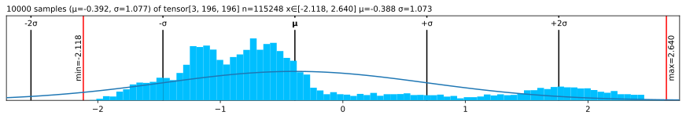
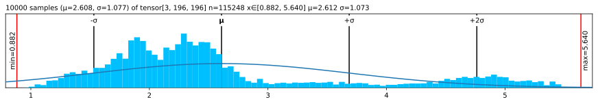
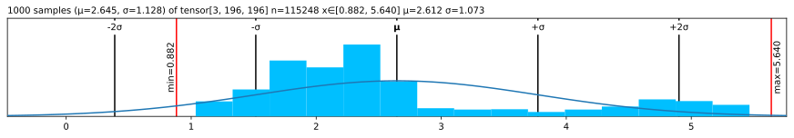

# ❤️ Lovely Tensors


<!-- WARNING: THIS FILE WAS AUTOGENERATED! DO NOT EDIT! -->

## [Read full docs](https://xl0.github.io/lovely-tensors)

### More lovely stuff

##### Working with numbers

- [Numpy](https://numpy.org/): ❤️ [Lovely
  NumPy](https://github.com/xl0/lovely-numpy)
- [JAX](https://jax.readthedocs.io/): 💘 [Lovely
  `JAX`](https://github.com/xl0/lovely-jax)
- [TinyGrad](https://github.com/tinygrad/tinygrad): 🫀 [Lovely
  Grad](https://github.com/xl0/lovely-grad)

##### Community

- [Discord](https://discord.gg/qBaqauUWXP)

## Install

``` sh
pip install lovely-tensors
```

or

``` sh
mamba install lovely-tensors
```

or

``` sh
conda install -c conda-forge lovely-tensors
```

## How to use

How often do you find yourself debugging PyTorch code? You dump a tensor
to the cell output, and see this:

``` python
numbers
```

    tensor([[[-0.3541, -0.3369, -0.4054,  ..., -0.5596, -0.4739,  2.2489],
             [-0.4054, -0.4226, -0.4911,  ..., -0.9192, -0.8507,  2.1633],
             [-0.4739, -0.4739, -0.5424,  ..., -1.0390, -1.0390,  2.1975],
             ...,
             [-0.9020, -0.8335, -0.9363,  ..., -1.4672, -1.2959,  2.2318],
             [-0.8507, -0.7822, -0.9363,  ..., -1.6042, -1.5014,  2.1804],
             [-0.8335, -0.8164, -0.9705,  ..., -1.6555, -1.5528,  2.1119]],

            [[-0.1975, -0.1975, -0.3025,  ..., -0.4776, -0.3725,  2.4111],
             [-0.2500, -0.2325, -0.3375,  ..., -0.7052, -0.6702,  2.3585],
             [-0.3025, -0.2850, -0.3901,  ..., -0.7402, -0.8102,  2.3761],
             ...,
             [-0.4251, -0.2325, -0.3725,  ..., -1.0903, -1.0203,  2.4286],
             [-0.3901, -0.2325, -0.4251,  ..., -1.2304, -1.2304,  2.4111],
             [-0.4076, -0.2850, -0.4776,  ..., -1.2829, -1.2829,  2.3410]],

            [[-0.6715, -0.9853, -0.8807,  ..., -0.9678, -0.6890,  2.3960],
             [-0.7238, -1.0724, -0.9678,  ..., -1.2467, -1.0201,  2.3263],
             [-0.8284, -1.1247, -1.0201,  ..., -1.2641, -1.1596,  2.3786],
             ...,
             [-1.2293, -1.4733, -1.3861,  ..., -1.5081, -1.2641,  2.5180],
             [-1.1944, -1.4559, -1.4210,  ..., -1.6476, -1.4733,  2.4308],
             [-1.2293, -1.5256, -1.5081,  ..., -1.6824, -1.5256,  2.3611]]])

Was it really useful for you, as a human, to see all these numbers?

What is the shape? The size?  
What are the statistics?  
Are any of the values `nan` or `inf`?  
Is it an image of a man holding a tench?

``` python
import lovely_tensors as lt
```

``` python
lt.monkey_patch()
```

## Summary

``` python
numbers # torch.Tensor
```

    tensor[3, 196, 196] n=115248 (0.4Mb) x∈[-2.118, 2.640] μ=-0.388 σ=1.073

``` python
numbers.rgb
```


``` python
numbers.plt
```



Better, huh?

``` python
numbers[1,:6,1] # Still shows values if there are not too many.
```

    tensor[6] x∈[-0.443, -0.197] μ=-0.311 σ=0.091 [-0.197, -0.232, -0.285, -0.373, -0.443, -0.338]

``` python
spicy = numbers[0,:12,0].clone()

spicy[0] *= 10000
spicy[1] /= 10000
spicy[2] = float('inf')
spicy[3] = float('-inf')
spicy[4] = float('nan')

spicy = spicy.reshape((2,6))
spicy # Spicy stuff
```

    tensor[2, 6] n=12 x∈[-3.541e+03, -4.054e-05] μ=-393.842 σ=1.180e+03 +Inf! -Inf! NaN!

``` python
torch.zeros(10, 10) # A zero tensor - make it obvious
```

    tensor[10, 10] n=100 all_zeros

``` python
spicy.v # Verbose
```

    tensor[2, 6] n=12 x∈[-3.541e+03, -4.054e-05] μ=-393.842 σ=1.180e+03 +Inf! -Inf! NaN!
    tensor([[-3.5405e+03, -4.0543e-05,         inf,        -inf,         nan, -6.1093e-01],
            [-6.1093e-01, -5.9380e-01, -5.9380e-01, -5.4243e-01, -5.4243e-01, -5.4243e-01]])

``` python
spicy.p # The plain old way
```

    tensor([[-3.5405e+03, -4.0543e-05,         inf,        -inf,         nan, -6.1093e-01],
            [-6.1093e-01, -5.9380e-01, -5.9380e-01, -5.4243e-01, -5.4243e-01, -5.4243e-01]])

## Named dimensions

``` python
named_numbers = numbers.rename("C", "H","W")
named_numbers
```

    /home/xl0/mambaforge/envs/lovely-py31-torch25/lib/python3.10/site-packages/torch/_tensor.py:1420: UserWarning: Named tensors and all their associated APIs are an experimental feature and subject to change. Please do not use them for anything important until they are released as stable. (Triggered internally at ../c10/core/TensorImpl.h:1925.)
      return super().rename(names)

    tensor[C=3, H=196, W=196] n=115248 (0.4Mb) x∈[-2.118, 2.640] μ=-0.388 σ=1.073

## Going `.deeper`

``` python
numbers.deeper
```

    tensor[3, 196, 196] n=115248 (0.4Mb) x∈[-2.118, 2.640] μ=-0.388 σ=1.073
      tensor[196, 196] n=38416 x∈[-2.118, 2.249] μ=-0.324 σ=1.036
      tensor[196, 196] n=38416 x∈[-1.966, 2.429] μ=-0.274 σ=0.973
      tensor[196, 196] n=38416 x∈[-1.804, 2.640] μ=-0.567 σ=1.178

``` python
# You can go deeper if you need to
# And we can use `.deeper` with named dimensions.

named_numbers.deeper(2)
```

    tensor[C=3, H=196, W=196] n=115248 (0.4Mb) x∈[-2.118, 2.640] μ=-0.388 σ=1.073
      tensor[H=196, W=196] n=38416 x∈[-2.118, 2.249] μ=-0.324 σ=1.036
        tensor[W=196] x∈[-1.912, 2.249] μ=-0.673 σ=0.522
        tensor[W=196] x∈[-1.861, 2.163] μ=-0.738 σ=0.418
        tensor[W=196] x∈[-1.758, 2.198] μ=-0.806 σ=0.397
        tensor[W=196] x∈[-1.656, 2.249] μ=-0.849 σ=0.369
        tensor[W=196] x∈[-1.673, 2.198] μ=-0.857 σ=0.357
        tensor[W=196] x∈[-1.656, 2.146] μ=-0.848 σ=0.372
        tensor[W=196] x∈[-1.433, 2.215] μ=-0.784 σ=0.397
        tensor[W=196] x∈[-1.279, 2.249] μ=-0.695 σ=0.486
        tensor[W=196] x∈[-1.364, 2.249] μ=-0.637 σ=0.539
        ...
      tensor[H=196, W=196] n=38416 x∈[-1.966, 2.429] μ=-0.274 σ=0.973
        tensor[W=196] x∈[-1.861, 2.411] μ=-0.529 σ=0.556
        tensor[W=196] x∈[-1.826, 2.359] μ=-0.562 σ=0.473
        tensor[W=196] x∈[-1.756, 2.376] μ=-0.622 σ=0.458
        tensor[W=196] x∈[-1.633, 2.429] μ=-0.664 σ=0.430
        tensor[W=196] x∈[-1.651, 2.376] μ=-0.669 σ=0.399
        tensor[W=196] x∈[-1.633, 2.376] μ=-0.701 σ=0.391
        tensor[W=196] x∈[-1.563, 2.429] μ=-0.670 σ=0.380
        tensor[W=196] x∈[-1.475, 2.429] μ=-0.616 σ=0.386
        tensor[W=196] x∈[-1.511, 2.429] μ=-0.593 σ=0.399
        ...
      tensor[H=196, W=196] n=38416 x∈[-1.804, 2.640] μ=-0.567 σ=1.178
        tensor[W=196] x∈[-1.717, 2.396] μ=-0.982 σ=0.350
        tensor[W=196] x∈[-1.752, 2.326] μ=-1.034 σ=0.314
        tensor[W=196] x∈[-1.648, 2.379] μ=-1.086 σ=0.314
        tensor[W=196] x∈[-1.630, 2.466] μ=-1.121 σ=0.305
        tensor[W=196] x∈[-1.717, 2.448] μ=-1.120 σ=0.302
        tensor[W=196] x∈[-1.717, 2.431] μ=-1.166 σ=0.314
        tensor[W=196] x∈[-1.560, 2.448] μ=-1.124 σ=0.326
        tensor[W=196] x∈[-1.421, 2.431] μ=-1.064 σ=0.383
        tensor[W=196] x∈[-1.526, 2.396] μ=-1.047 σ=0.417
        ...

## Now in `.rgb` color

The important queston - is it our man?

``` python
numbers.rgb
```


*Maaaaybe?* Looks like someone normalized him.

``` python
in_stats = ( (0.485, 0.456, 0.406),     # mean
             (0.229, 0.224, 0.225) )    # std

# numbers.rgb(in_stats, cl=True) # For channel-last input format
numbers.rgb(in_stats)
```


It’s indeed our hero, the Tenchman!

## `.plt` the statistics

``` python
(numbers+3).plt(center="mean", max_s=1000)
```



``` python
(numbers).plt
```



``` python
(numbers+3).plt(center="range")
```


## See the `.chans`

``` python
# .chans will map values betwen [-1,1] to colors.
# Make our values fit into that range to avoid clipping.
mean = torch.tensor(in_stats[0])[:,None,None]
std = torch.tensor(in_stats[1])[:,None,None]
numbers_01 = (numbers*std + mean)
numbers_01
```

    tensor[3, 196, 196] n=115248 (0.4Mb) x∈[0., 1.000] μ=0.361 σ=0.248

``` python
numbers_01.chans
```


Let’s try with a Convolutional Neural Network

``` python
from torchvision.models import vgg11
```

``` python
features: torch.nn.Sequential = vgg11().features

# I saved the first 5 layers in "features.pt"
_ = features.load_state_dict(torch.load("../features.pt", weights_only=True), strict=False)
```

``` python
# Activatons of the second max pool layer of VGG11
acts = (features[:6](numbers[None])[0]/2) # /2 to reduce clipping
acts
```

    tensor[128, 49, 49] n=307328 (1.2Mb) x∈[0., 12.508] μ=0.367 σ=0.634 grad DivBackward0

``` python
acts[:4].chans(cmap="coolwarm", scale=4)
```


## Grouping

``` python
# Make 8 images with progressively higher brightness and stack them 2x2x2.
eight_images = (torch.stack([numbers]*8)
                    .add(torch.linspace(-3, 3, 8)[:,None,None,None])
                    .mul(torch.tensor(in_stats[1])[:,None,None])
                    .add(torch.tensor(in_stats[0])[:,None,None])
                    .clamp(0,1)
                    .view(2,2,2,3,196,196)
)
eight_images
```

    tensor[2, 2, 2, 3, 196, 196] n=921984 (3.5Mb) x∈[0., 1.000] μ=0.411 σ=0.369

``` python
eight_images.rgb
```


``` python
# Weights of the second conv layer of VGG11
features[3].weight
```

    Parameter[128, 64, 3, 3] n=73728 (0.3Mb) x∈[-0.783, 0.776] μ=-0.004 σ=0.065 grad

I want +/- 2σ to fall in the range \[-1..1\]

``` python
weights = features[3].weight.data
weights = weights / (2*2*weights.std()) # *2 because we want 2σ on both sides, so 4σ
# weights += weights.std() * 2
weights.plt
```


``` python
# Weights of the second conv layer (64ch -> 128ch) of VGG11,
# grouped per output channel.
weights.chans(frame_px=1, gutter_px=0)
```


It’s a bit hard to see. Scale up 10x, but onyl show the first 4 filters.

``` python
weights[:4].chans(frame_px=1, gutter_px=0, scale=10)
```


## Options \| [Docs](https://xl0.github.io/lovely-tensors/utils.config.html)

``` python
from lovely_tensors import set_config, config, lovely, get_config
```

``` python
set_config(precision=1, sci_mode=True, color=False)
torch.tensor([1, 2, torch.nan])
```

    tensor[3] μ=1.5e+00 σ=7.1e-01 NaN! [1.0e+00, 2.0e+00, nan]

``` python
set_config(precision=None, sci_mode=None, color=None) # None -> Reset to defaults
```

``` python
print(torch.tensor([1., 2]))
# Or with config context manager.
with config(sci_mode=True, precision=5):
    print(torch.tensor([1., 2]))

print(torch.tensor([1., 2]))
```

    tensor[2] μ=1.500 σ=0.707 [1.000, 2.000]
    tensor[2] μ=1.50000e+00 σ=7.07107e-01 [1.00000e+00, 2.00000e+00]
    tensor[2] μ=1.500 σ=0.707 [1.000, 2.000]

## Without `.monkey_patch`

``` python
lt.lovely(spicy)
```

    tensor[2, 6] n=12 x∈[-3.541e+03, -4.054e-05] μ=-393.842 σ=1.180e+03 +Inf! -Inf! NaN!

``` python
lt.lovely(spicy, verbose=True)
```

    tensor[2, 6] n=12 x∈[-3.541e+03, -4.054e-05] μ=-393.842 σ=1.180e+03 +Inf! -Inf! NaN!
    tensor([[-3.5405e+03, -4.0543e-05,         inf,        -inf,         nan, -6.1093e-01],
            [-6.1093e-01, -5.9380e-01, -5.9380e-01, -5.4243e-01, -5.4243e-01, -5.4243e-01]])

``` python
lt.lovely(numbers, depth=1)
```

    tensor[3, 196, 196] n=115248 (0.4Mb) x∈[-2.118, 2.640] μ=-0.388 σ=1.073
      tensor[196, 196] n=38416 x∈[-2.118, 2.249] μ=-0.324 σ=1.036
      tensor[196, 196] n=38416 x∈[-1.966, 2.429] μ=-0.274 σ=0.973
      tensor[196, 196] n=38416 x∈[-1.804, 2.640] μ=-0.567 σ=1.178

``` python
lt.rgb(numbers, in_stats)
```


``` python
lt.plot(numbers, center="mean")
```


``` python
lt.chans(numbers_01)
```


## Matplotlib integration \| [Docs](https://xl0.github.io/lovely-tensors/matplotlib.html)

``` python
numbers.rgb(in_stats).fig # matplotlib figure
```


``` python
(numbers*0.3+0.5).chans.fig # matplotlib figure
```


``` python
numbers.plt.fig.savefig('pretty.svg') # Save it
```

``` python
!file pretty.svg; rm pretty.svg
```

    pretty.svg: SVG Scalable Vector Graphics image

### Add content to existing Axes

``` python
fig = plt.figure(figsize=(8,3))
fig.set_constrained_layout(True)
gs = fig.add_gridspec(2,2)
ax1 = fig.add_subplot(gs[0, :])
ax2 = fig.add_subplot(gs[1, 0])
ax3 = fig.add_subplot(gs[1,1:])

ax2.set_axis_off()
ax3.set_axis_off()

numbers_01.plt(ax=ax1)
numbers_01.rgb(ax=ax2)
numbers_01.chans(ax=ax3);
```


## torch.compile()

Just works.

``` python
def func(x):
    return x*2

if torch.__version__ >= "2.0":
    func = torch.compile(func)

func(torch.tensor([1,2,3]))
```

    tensor[3] i64 x∈[2, 6] μ=4.000 σ=2.000 [2, 4, 6]

## Inport hook

Lovely tensors installes an import hook. Set `LOVELY_TENSORS=1`, and it
will load automatically, no need to modify the code: \> Note: Don’t set
it globally, or all python scripts you run will import LT and PyTorch,
which will slow things down.

``` python
import torch

x = torch.randn(4, 16)
print(x)
```

``` bash
LOVELY_TENSORS=1 python test.py
```

    x: tensor[4, 16] n=64 x∈[-1.652, 1.813] μ=-0.069 σ=0.844

This is especially useful in combination with [Better
Exceptions](https://github.com/Qix-/better-exceptions):

``` python
import torch

x = torch.randn(4, 16)
print(f"x: {x}")

w = torch.randn(15, 8) 
y = torch.matmul(x, w) # Dimension mismatch
```

``` bash
BETTER_EXCEPTIONS=1  LOVELY_TENSORS=1 python test.py 
```

    x: tensor[4, 16] n=64 x∈[-1.834, 2.421] μ=0.103 σ=0.896
    Traceback (most recent call last):
      File "/home/xl0/work/projects/lovely-tensors/test.py", line 7, in <module>
        y = torch.matmul(x, w)
            │            │  └ tensor[15, 8] n=120 x∈[-2.355, 2.165] μ=0.142 σ=0.989
            │            └ tensor[4, 16] n=64 x∈[-1.834, 2.421] μ=0.103 σ=0.896
            └ <module 'torch' from '/home/xl0/mambaforge/envs/torch25-py313/lib/python3.12/site-packages/torch/__init__.py'>
    RuntimeError: mat1 and mat2 shapes cannot be multiplied (4x16 and 15x8)
